# Asspull IIIx
## ROM source archive
This repository contains the full source for the *Asspull IIIx* ROM files — the BIOS and boot firmware, and a handful of functionality tests. They can be built in [devkitPro](https://devkitpro.org/)... is what I would *like* to say but I must've misremembered where I got devkit68K from. So grab [this copy](http://helmet.kafuka.org/devkit68k.rar) and unpack it in your devkitPro directory or whatever, and make sure you `set DEVKIT68K=/opt/devkitPro/devkit68K` (to match what devkitPro put). That *should* set you up well enough. If you don't have devkitPro installed, you don't actually need any of the specific kits, just the base system. A copy of grit is included in the devkit68K archive and I'm thinking of writing my own anyway.

For that matter, you'll also need Python 3.8 or later installed, so you can use the included tools. If the graphics related tools don't work, run `pip install Pillow` and try again.

### `_disk1_` and `_disk2_`
These two folders are the source for `disk1.img` and `disk2.img`, as built with the included copy of `bfi.exe`.

### `basic`
A work-in-progress classic BASIC interpreter. The same source file is shared between the A3X version and a Visual Studio 2015 project for ease of testing.

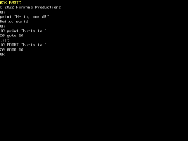

### `bios`
This is the complete source of the BIOS and boot firmware. It compiles to `ass-bios.apb` ("*a*ss*p*ull *b*ios") and contains several functions available to other programs, subdivided into a couple different libraries, Amiga style.

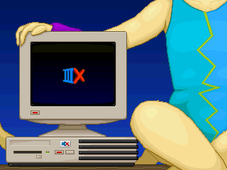
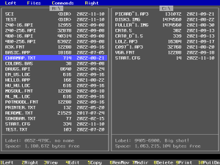

### `columns`
It's *Columns*, and it's in development.

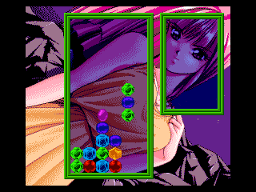

### `devkit68k`
Contains the linker scripts and such. Merge it into devkitPro's `devkit68K` folder.

### `devprinter`
A small "Hello World" variant that demonstrates how to identify and use an external line printer device.

### `fromdisk`
Hello World, but as a file on a bootable diskette. It compiles straight into `_disk2_` as an `app` file ("*a*ss*p*ull *p*rogram"), that you can run from the Navigator.

### `hdma-api`
Testing `api`-format images, but with HDMA gradients baked in.

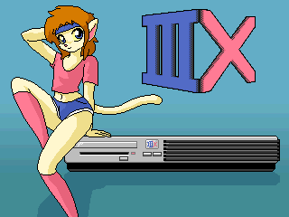

### `helloworld`
Much the same as `fromdisk`, but as a cart application.

### `midiboard`
A toy piano. Use the keyboard to play notes, change octaves with the left and right arrow keys, and change instruments with the up and down arrow keys.

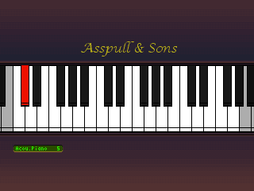

### `ranmya`
A more graphical Hello World featuring the *previous*, placeholder mascot. Should be updated and renamed.

### `rpg`
A work-in-progress JRPG framework.

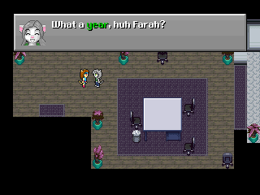

### `salanyander`
An attempt to make a Gradius-style horizontal space shooter.

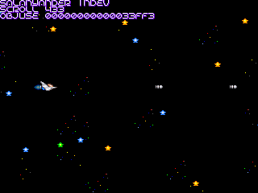

### `slideshow`
Tries to display all the `api` files on the currently-inserted diskette.

### `snake`
Your classic snake game. Not Nibbles -- that would require level layouts. Maybe later?

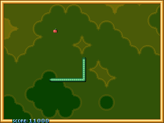

### `sokoban`
The classic box pushing puzzle.

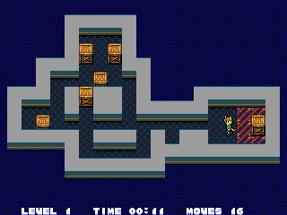

### `test`
A test suite that will eventually cover all features of the system.

### `tetris`
It's *Tetris*, and it's in development.

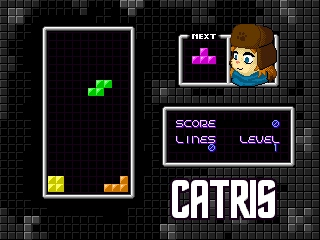

### `tiletest`
Early work to test the games console-style tilemap mode.

### `twohundred`
Normally, the A3X draws 240 or 480 lines, but by setting the bold font flag in graphics mode you can make it draw 200 or 400 lines, stretched.

## How to make your own A3X stuff
* Get DevkitPro and install at *least* devkit68k.
* Copy the contents of the `devkit68K` directory into DKP's.
* From this repo's directory, try running `make`.
* If that worked, you should have a bunch of `ap3` files, among others.
* Make a new folder for your project and copy the contents of `helloworld` into it. Note that the makefile refers to `../ass_romrules`, so if you want it somewhere else adjust the makefile accordingly.
* Change the `TARGET` variable in the makefile, and the internal name in `crt0.s`.
* Check if it builds.
* Study `ass.h` and any relevant other projects well. The rest is not entirely unlike any other console.

## Acknowledgements
* `bios` uses [*FatFS* by ChaN](http://elm-chan.org/fsw/ff/00index_e.html).
* *Farah Furcett* character named by Screwtape.
* Sokoban tileset by [/dev/urandom](https://devurandom.xyz).
* Snake game ported from [an implementation by Jason Kruse](https://github.com/mnisjk/snake).
* Tetris game ported from [an implementation by Marco Lucidi](https://github.com/MarcoLucidi01/tetris_clone).
* IMF player based on work by K1n9 Duk3.
* `.data` segment help by Dmitry Grinberg.
